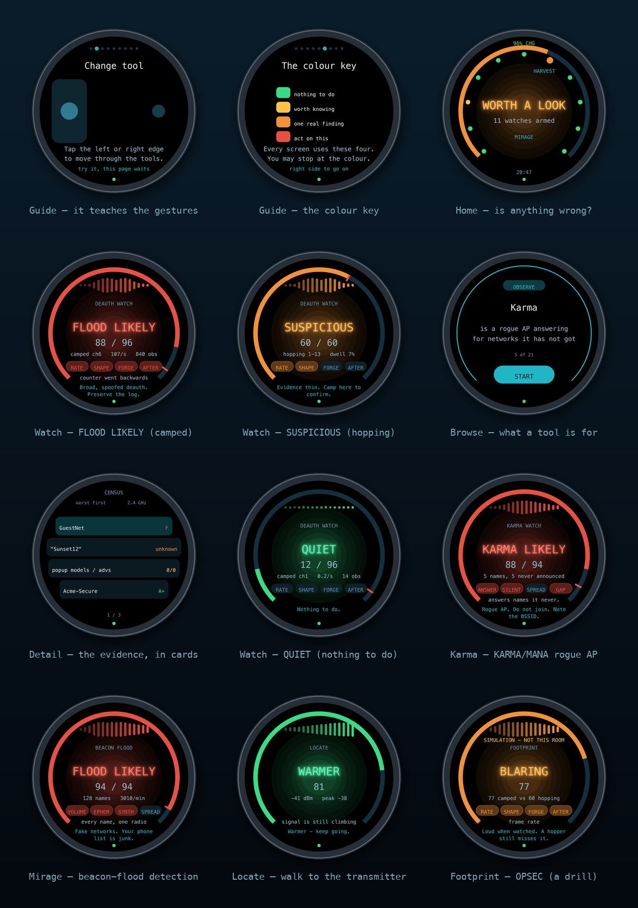
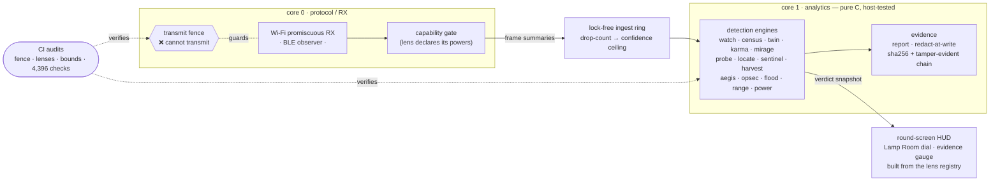

<p align="center">
  
</p>

<h1 align="center">Pharos</h1>

<p align="center">
  <b>A defensive, receive-only RF observatory for the Waveshare ESP32-S3-Touch-AMOLED-1.75C.</b><br>
  A lighthouse that listens: it watches the 2.4&nbsp;GHz air, grades what it hears, and is honest about what it cannot.
</p>

<p align="center">
  <a href="https://at0m-b0mb.github.io/Pharos-ESP32S3/"></a>
  <a href="#the-transmit-fence"></a>
  
  
  
  
</p>

---

## What it is

Pharos turns a £40 round-screen dev board into a **touch-first instrument for lawful wireless defence and training**. It is built for the two people who should own a tool like this:

- **the blue-teamer** walking a site, who needs to know if somebody is knocking clients off the Wi-Fi, whether the access points are configured the way policy says, and what the room is leaking; and
- **the learner** — red or blue — who needs to *understand* those attacks on real instrumentation without a lab full of gear, and without ever transmitting a frame.

It is inspired by the usability and extensibility of the Evil-M5Project, and deliberately takes the opposite stance on one thing: **Pharos cannot transmit.** Not "does not by default" — *cannot*. That is enforced by the build, checked in CI, and provable on the device's own screen. See [the transmit fence](#the-transmit-fence).

> [!IMPORTANT]
> **Authorisation first.** Even passive monitoring is regulated in some places, and *acting* on what you find is your responsibility. Use Pharos only on networks and in engagements you are authorised to assess. Read [docs/SAFETY.md](docs/SAFETY.md) before you switch it on.

## Why it is different

Most hobby RF tools answer "is there an attack?" with a confident yes/no. Pharos will not, because the hardware will not let it be honest that way:

> The ESP32-S3 has **one receiver**. To cover 2.4 GHz it hops, so it hears roughly **7% of any one channel** at a time. Multiplying an observed count by fourteen gives an *estimate*, not a *measurement*.

So every verdict Pharos produces carries a **confidence ceiling** derived from how much of the channel it actually heard. A deauth flood reads `FLOOD LIKELY` when you camp on its channel and only `SUSPICIOUS` when you keep hopping — the same traffic, a different honesty. There is no band named "safe". Absence of evidence on a receiver that hears 7% of the air is not evidence of absence, and the firmware never pretends otherwise.

This honesty is not a disclaimer bolted on. It is arithmetic, and it is [tested](test/host): 5,164 host checks assert, among much else, that no single loud reading can raise an alarm on its own and that hopping can never reach the top band.

## What it looks like

Every screenshot below is **generated from the firmware's own code** — the real
`pharos_round`/`pharos_dial` geometry, driven by the real detection engines, fed
by the real training scenarios. Nothing here is a mock-up drawn in a design tool.

<p align="center">
  
  
</p>

**This pair is the whole argument.** Identical event stream, both sides. Camped
on the channel, the Watch engine reaches `FLOOD LIKELY` at 88. Hopping across
1–13, the same evidence tops out at `SUSPICIOUS` — the red `CEIL 60` tick is the
hard stop, and the dim arc past it is the score that was **earned and then taken
away** because a receiver hearing 7% of a channel is not entitled to claim it.

<p align="center">
  
</p>

Regenerate them yourself — and note that the generator **bounds-checks every
primitive against the panel's safe radius**, so "does the UI fit on a circle" is
a CI result rather than an opinion:

```bash
make -C tools/render        # writes assets/screens/*.png
make -C tools/render check  # asserts nothing escapes the glass
```

## The lenses

A **lens** is one tool. The dial is built from whatever lenses are compiled in; adding one is adding a single `.c` file. Every lens declares its hardware powers at compile time, and the radio refuses any power a lens did not declare.

| Lens | Team | What it does |
|------|------|--------------|
| **Spectrum** | 🔵 recon | 2.4 GHz airtime waterfall — the map you read the others against. States, permanently, that it is deaf above 2.4 GHz. |
| **Watch** | 🔵 detect | Grades deauthentication / disassociation floods across three evidence families, with a confidence ceiling. The headliner. |
| **Census** | 🔵 audit | Grades every nearby network A+…F on what it would take to break in — auth, 802.11w, cipher, WPS. |
| **Twin** | 🔵 detect | Finds the rogue AP wearing a name that belongs to someone else — and scores BSSID multiplicity at *zero*, because roaming is not an attack. |
| **Karma** | 🔵 detect | Catches the rogue AP that answers to *any* name a passing phone asks for — while scoring a legitimate multi-SSID deployment at zero. |
| **Mirage** | 🔵 detect | Detects the beacon/SSID-spam flood that fills every phone's network list — the exact attack the ESP32 world is famous for — while scoring a dense city as *busy, not hostile*. |
| **Locate** | 🔵 hunt | Once a source is flagged, walk toward it: a smoothed RSSI *hotter / colder / here* game. Finds a transmitter without becoming one. |
| **Aegis** | 🔵 command | **The one screen that tells the story.** Every other lens forgets; Aegis remembers. It latches each finding with the time it happened, so a burst that fired while you were looking at another lens is still there ten minutes later — and it scores a *sequence* (recon → twin → disruption → collection) far above the same alarms in a jumble, because that ordering is an operation rather than a noisy afternoon. |
| **Vigil** | 🟢 personal | **Is an item tracker travelling with you?** The first lens to use the Bluetooth radio. Seeing an AirTag means nothing — a café has a dozen. What matters is whether one is still with you *after you have moved*, so Vigil infers movement from the Wi-Fi landscape turning over and only counts a tag that survives it. Never claims intent, never says you are safe. |
| **Squall** | 🔵 triage | **"The Wi-Fi is down — is it broken, busy, or jammed?"** Three problems with three completely different responses, identical to the user. Squall separates them on the one measure that works: *energy versus decodability*. Loud **and** productive is a busy building. Loud and **barren** — fewer frames per second than a single AP's beacons — is the shape of a jam. A busy office is never called an attack. |
| **Harvest** | 🔵 detect | Catches somebody collecting your handshakes to crack offline — the attack where nothing breaks and nobody complains. Separates the **forced** cycle (knock a client off, catch it reconnecting) from the **clientless PMKID** solicitation, and knows a rebooting router looks identical to one forced cycle. |
| **Sentinel** | 🔵 audit | Answers the question that starts incidents: *what changed since I last swept this site?* Adopt a baseline while the estate is clean, then it diffs every later sweep — new radios, a network that quietly dropped its 802.11w, an AP gone missing — and scores a **downgrade** far above ordinary churn. |
| **Probe** | 🟣 recon | Shows a room what its phones broadcast about their owners, and defeats MAC randomisation to prove the point. Awareness-session gold. |
| **Range** | 🔴🔵 train | Plays synthesised attacks through the **real** detection engines so you can learn to read the gauge. Holds no radio at all. |
| **Footprint** | 🔴 train | The red team's mirror: grades how *detectable* an attack is, names the family that gives it away, and tells you whether a hopping defender would even notice. Receive-only OPSEC. |
| **System** | ⚙️ audit | Battery, region, and live proof the transmit fence is clean. |

Red, blue, and purple all run on the **same engines**. The Range doesn't simulate a detector — it drives the actual one, so what you learn on it is exactly what you see in the field. See [docs/REDBLUE.md](docs/REDBLUE.md) for how Pharos serves each side.

### For red teams: know your own signature

Pharos will not transmit — that's the whole point, and it's why it can go into rooms offensive tools can't. What it gives a red-teamer instead is arguably more valuable: **OPSEC insight**. The **Footprint** lens grades any attack from the defender's side of the glass, against a camped defender *and* a hopping one:

<p align="center">
  
  
</p>

Left: a broadcast deauth flood reads **BLARING** to a camped defender (88) but only 60 to a hopping one — the dominant tell is *frame rate*, and the takeaway is stated plainly: *loud when watched, a hopping defender misses it*. Right: **Mirage** catching a 300-name beacon flood at **FLOOD LIKELY**, while a dense-city rooftop of 60 real networks scores *busy, not hostile*.

## The transmit fence

Receive-only is the product, so it is enforced four ways, and CI checks all four:

1. **Capability tokens.** Every lens declares its powers at compile time. There is no `CAP_WIFI_TX` token to hold — you cannot request what does not exist.
2. **Link-time wrap fence.** Every Espressif/NimBLE transmit primitive (`esp_wifi_80211_tx`, `esp_wifi_deauth_sta`, `esp_now_send`, AP-mode `esp_wifi_set_mode`, …) is redirected by `-Wl,--wrap` to an abort trap. Call one and the firmware halts at the call site rather than emitting a frame.
3. **Build-time role fence.** NimBLE is compiled **observer-only**; the advertising and connection code is not in the image. The BLE scan is additionally **passive** — an *active* scan answers every advertisement with a `SCAN_REQ`, which is a transmission, so `passive = 1` is audited in CI like every other mechanism.
4. **Source audit.** [`tools/check_tx_fence.sh`](tools/check_tx_fence.sh) greps the tree for transmit primitives and verifies all four mechanisms, on every commit.

The **System** lens reads the fence's own status and shows it on screen. A device that asks to be trusted in a building it does not own can *prove* it is only listening.

```bash
./tools/check_tx_fence.sh        # → FENCE INTACT - receive-only posture verified.
```

## Evidence you can defend

A report anyone can edit afterwards is a note, not evidence. Every record Pharos
commits is hash-linked to the one before it:

```
H(n) = SHA-256( H(n-1) || seq || t_us || kind || payload )
```

Modification, deletion, insertion and reordering are all caught by
`phc_verify` — each has a test. Addresses are redacted **at write time** (OUI-only
or salted-hash), never at export, so a full MAC that was never written cannot
leak from a partition image or a crash dump.

What it deliberately does *not* claim: this is **integrity, not authorship**. A
device you can disassemble cannot keep a signing key from its owner. Publish the
head digest somewhere you don't control — a ticket, a message to the client at
the end of the walk — and you have a timestamp someone else witnessed. That is
the honest version of the guarantee, and it is the one Pharos makes.

## Build & run

**The engines and UI geometry build and test with no board at all** — do this first, it is fast and catches the most:

```bash
make -C test/host                # 5164 checks, 0 failures
```

> [!TIP]
> **⚡ Flash it from your browser — no toolchain.** Open **[at0m-b0mb.github.io/Pharos-ESP32S3](https://at0m-b0mb.github.io/Pharos-ESP32S3/)** in Chrome or Edge, plug the board in over USB-C, and click Install. The page serves the same audited binary as the release and flashes over Web Serial — nothing is uploaded anywhere.

**Prebuilt firmware** is attached to each [release](https://github.com/at0m-b0mb/Pharos-ESP32S3/releases) — a single flashable image built and audited in CI:

```bash
esptool.py --chip esp32s3 write_flash 0x0 pharos-v1.7.0-esp32s3.bin
```

**Build it yourself**, with [ESP-IDF](https://docs.espressif.com/projects/esp-idf/) 5.5 or newer:

```bash
idf.py set-target esp32s3
idf.py build flash monitor
```

The board driver, LVGL, and the panel init come from Waveshare's managed BSP component (pinned in [`main/idf_component.yml`](main/idf_component.yml)); Pharos does not re-drive the AMOLED.

## Architecture at a glance

Two cores, split by role. The radio side has a hard real-time budget and does the minimum; everything that *reasons* runs on the other core, in pure C, against copied data — which is why all of it is testable on a laptop.



- **`components/pharos_engine/`** — the judgement. Pure C11, no ESP-IDF, no allocation, no floating point in scored paths. Every detector, the evidence chain, and the round-screen maths live here, and every line of it is host-tested.
- **`components/pharos_radio/`** — the only component that touches the radio, and the four-mechanism [transmit fence](#the-transmit-fence) around it.
- **`components/pharos_ui/`** — round-screen geometry, the Lamp Room dial, the evidence gauge — tested as maths before a pixel is drawn — plus the "Virtual Pharos" renderer that produces the screenshots above.
- **`components/pharos_lens_*/`** — one tool each, self-registering via a constructor; `main.c` names none of them.

Full detail in [docs/DESIGN.md](docs/DESIGN.md).

## Documentation

| | |
|--|--|
| [docs/DESIGN.md](docs/DESIGN.md) | Architecture, the honesty model, and how to add a lens. |
| [docs/REDBLUE.md](docs/REDBLUE.md) | How Pharos serves red, blue and purple teams — lawfully. |
| [docs/POLICY.md](docs/POLICY.md) | The safety guardrails, and *why* each one exists. |
| [docs/HARDWARE.md](docs/HARDWARE.md) | The board, the pin map, and every `VERIFY` still open. |
| [docs/SAFETY.md](docs/SAFETY.md) | Legal & ethical use. Read before switching on. |
| [docs/ROADMAP.md](docs/ROADMAP.md) | Milestones M1–M6 and what is proven vs. scaffolded. |
| [CONTRIBUTING.md](CONTRIBUTING.md) | The four rules that are the product, not style. |
| [⚡ Web flasher](https://at0m-b0mb.github.io/Pharos-ESP32S3/) | Flash from Chrome/Edge over USB — no toolchain. |

## Status

**v1.7.0 — the display fixed at the source, a real CLI, and both radios finally working.**

| Layer | State | Detail |
|---|---|---|
| **Detection & evidence engines** | ✅ complete, **5,164 host checks, 0 failures** | 18 detection/analysis engines + report/chain/sha256, all pure C, all tested on a laptop |
| **Round-screen geometry & Virtual HUD** | ✅ complete & tested | layout maths host-tested; every screen rendered from the real code and bounds-checked in CI |
| **Transmit fence** | ✅ enforced & audited | 4 mechanisms, verified against the linked ELF on every build |
| **Firmware build** | ✅ green on ESP-IDF v5.5 + v6.0 | a **flashable binary is attached to each [release](https://github.com/at0m-b0mb/Pharos-ESP32S3/releases)** |
| **Board bring-up (display + touch)** | ✅ driven via the Waveshare BSP | CO5300 AMOLED + CST9217 touch via `bsp_display_start()`; IMU/PMU telemetry still M1 |
| **On-device LVGL rendering** | ✅ HUD live — **display fix in v1.5.0** | v1.4.0 powered the panel but never drew to it: the BSP's LVGL lock returns `esp_err_t` (`ESP_OK == 0`) and was read as a bool, so every paint saw a successful lock as failure and bailed. Fixed; the boot splash + gauge now render. |

> [!NOTE]
> **Hardware bring-up in progress.** The engines and UI geometry are proven in software; the panel-paint path is now fixed against a real board. IMU/PMU telemetry and touch-driven dial navigation remain. See [CHANGELOG.md](CHANGELOG.md) and [docs/ROADMAP.md](docs/ROADMAP.md).

**16 lenses** · **18 engines** · a receive-only serial console · MIT.

## License

[MIT](LICENSE) © at0m-b0mb. Built for people who defend networks and the people learning to.
